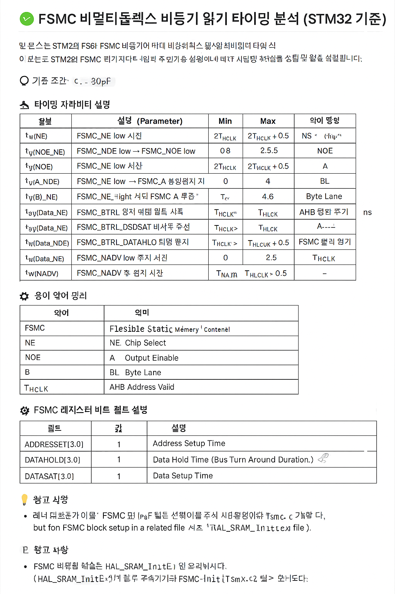
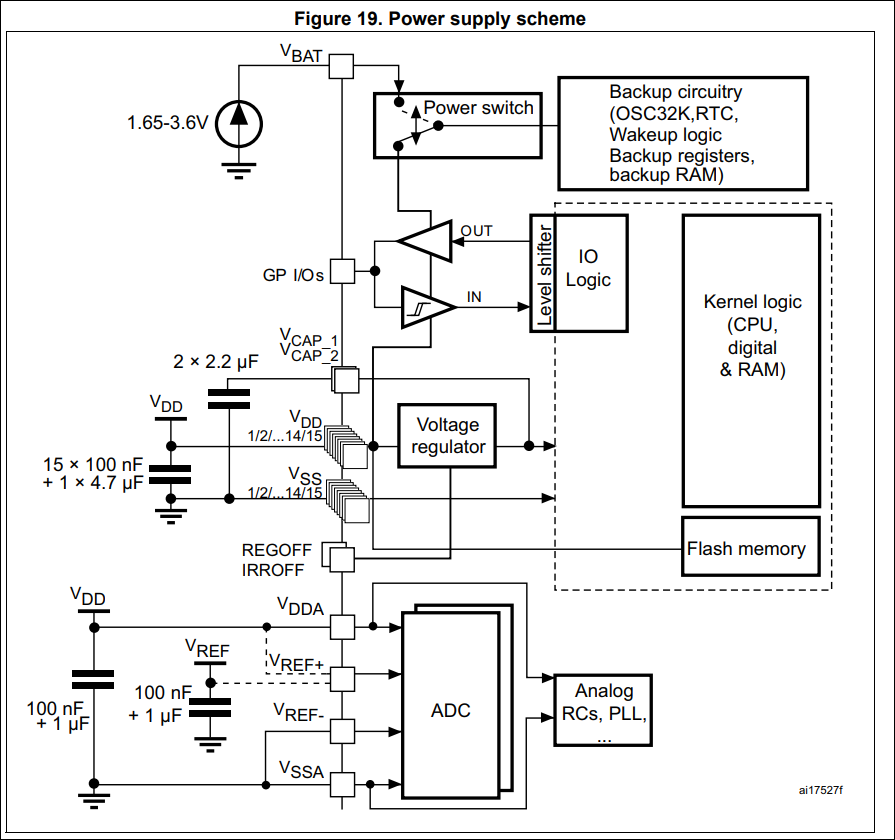

## 📘 FSMC 비멀티플렉스 비동기 읽기 타이밍 및 레지스터 설정 예제 (STM32)


📚 목차

📘 소개

📐 타이밍 파라미터 설명

🧰 SRAM 회로 예시 및 연결 가이드

🧲 PSRAM / NOR Flash 연결 예시

🔧 CubeMX 설정 팁 (XIP 포함)

🛠️ FSMC 쓰기 타이밍

🧪 디버깅 체크리스트


📎 참고 사항
STM32의 FSMC(Flexible Static Memory Controller)를 사용해 비멀티플렉스 방식으로 SRAM/PSRAM/NOR 메모리를 비동기적으로 읽을 때의 타이밍 제약 및 관련 레지스터 설정을 설명합니다.

> ✅ 기준: C_L = 30pF

---

### 📐 타이밍 파라미터 설명

| 심볼 | 설명 | Min | Max | 단위 | 약어 설명 |
|------|------|-----|-----|------|------------|
| `t_W(NE)` | FSMC_NE low 시간 | 2T_HCLK - 0.5 | 2T_HCLK + 0.5 | ns | NE: Chip Select 신호 |
| `t_V(NOE_NE)` | FSMC_NEx low → FSMC_NOE low 전파 지연 | 0.5 | 2.5 | ns | NOE: Output Enable |
| `t_W(NOE)` | FSMC_NOE low 시간 | 2T_HCLK - 1 | 2T_HCLK + 0.5 | ns |  |
| `t_H(NE_NOE)` | FSMC_NOE high → FSMC_NE high 유지 시간 | 0 | - | ns |  |
| `t_V(A_NE)` | FSMC_NEx low → FSMC_A 유효 | - | 4 | ns | A: Address |
| `t_H(A_NOE)` | FSMC_NOE high 이후 Address 유지 시간 | 0 | - | ns |  |
| `t_V(BL_NE)` | FSMC_NEx low → FSMC_BL 유효 | - | 0.5 | ns | BL: Byte Lane |
| `t_H(BL_NOE)` | FSMC_NOE high 이후 FSMC_BL 유지 시간 | 0 | - | ns |  |
| `t_SU(Data_NE)` | 데이터 → FSMC_NEx high 셋업 시간 | T_HCLK + 0.5 | - | ns |  |
| `t_SU(Data_NOE)` | 데이터 → FSMC_NOEx high 셋업 시간 | T_HCLK + 0.5 | - | ns |  |
| `t_H(Data_NOE)` | FSMC_NOE high 이후 데이터 유지 시간 | 0 | - | ns |  |
| `t_H(Data_NE)` | FSMC_NEx high 이후 데이터 유지 시간 | 0 | - | ns |  |
| `t_V(NADV_NE)` | FSMC_NEx low → FSMC_NADV low 전파 지연 | - | 2.5 | ns | NADV: Address Valid |
| `t_W(NADV)` | FSMC_NADV low 유지 시간 | - | T_HCLK - 0.5 | ns |  |

---

### 🔤 약어 설명

| 약어 | 의미 |
|------|------|
| FSMC | Flexible Static Memory Controller (유연한 정적 메모리 컨트롤러) |
| NE | Chip Select (Negative Enable) |
| NOE | Output Enable (출력 허리) |
| A | Address (주소 버스) |
| BL | Byte Lane (바이트 라인) |
| Data | 데이터 버스 |
| NADV | Address Valid (주소 유효 신호) |
| T_HCLK | FSMC 클럭 주기 (예: 72 MHz → 약 13.89 ns) |

---

### 🧪 FSMC 레지스터 설정 예시 (STM32CubeIDE 기준)

```c
// 예: FSMC_BTR1 레지스터 (Bank1 NOR/SRAM region1)
FSMC_Bank1->BTCR[0] = 0x00001011; // 기본 제어 (Read/Write enable 등)
FSMC_Bank1->BTCR[1] = 
    (1 << 0)  |  // ADDSET: Address setup time (1 HCLK)
    (2 << 4)  |  // ADDHLD: Address-hold time (2 HCLK)
    (3 << 8)  |  // DATAST: Data setup time (3 HCLK)
    (0 << 16) |  // BUSTURN: Bus turnaround (0 HCLK)
    (0 << 28);   // ACCMOD: Access mode A
```

> 💡 `FSMC_Bank1->BTCR[0]`: 제어 레지스터
> 
> 💡 `FSMC_Bank1->BTCR[1]`: 타이밍 설정 레지스터

---

### 🧾 FSMC 주요 레지스터 비트 필드 요약

#### FSMC_BCRx (Bank Control Register)

| 비트 | 필드명 | 설명 |
|------|--------|------|
| 0 | MBKEN | Memory bank enable |
| 1 | MUXEN | Address/data multiplexing enable |
| 2 | MTYP | Memory type (00: SRAM, 01: PSRAM, 10: NOR) |
| 4 | MWID | Memory data bus width (00: 8bit, 01: 16bit) |
| 8 | WREN | Write enable |
| 12 | CBURSTRW | Burst access mode (NOR만 해당) |

#### FSMC_BTRx (Timing Register)

| 비트 | 필드명 | 설명 |
|------|--------|------|
| 3:0 | ADDSET | Address setup time (HCLK 단위) |
| 7:4 | ADDHLD | Address hold time |
| 15:8 | DATAST | Data setup time |
| 19:16 | BUSTURN | Bus turnaround duration |
| 28:27 | ACCMOD | Access mode (A/B/C/D) |

> 참고: NOR 플래시를 사용할 경우 ADDHLD, BUSTURN 등을 보수적으로 크게 잡는 것이 안정적임

---

### 📸 STM32CubeMX 설정 예시 이미지

아래 이미지는 FSMC 관련 설정 예시를 시각적으로 보여줍니다:



---


🧲 외부 PSRAM 및 NOR Flash 연결 예시

🔹 외부 PSRAM (예: APS6404L-3SQR)

주소선 A0~Ax → FSMC_A[0~x]

데이터선 D0~15 → FSMC_D[0~15]

/CE (Chip Enable) → FSMC_NE1~4 중 하나

/OE (Output Enable) → FSMC_NOE

/WE (Write Enable) → FSMC_NWE

ADV# (Address Valid) → FSMC_NADV

WAIT → FSMC_NWAIT (옵션)

PSRAM은 MUX 모드를 사용하는 경우 FSMC_BCR의 MUXEN 비트를 설정해야 합니다.

FSMC_Bank1->BTCR[2] = // PSRAM 대상 Bank (NE2 기준)
    (1 << 0)  |  // MBKEN
    (1 << 1)  |  // MUXEN: 주소/데이터 멀티플렉스 모드
    (1 << 2)  |  // MTYP: PSRAM
    (1 << 4)  |  // MWID: 16-bit
    (1 << 8);    // WREN

🔸 외부 NOR Flash (예: M29W128GL)

주소선 A0~Ax → FSMC_A[x]

데이터선 D0~15 → FSMC_D[0~15]

/CE → FSMC_NE1~4

/OE → FSMC_NOE

/WE → FSMC_NWE

/RESET → GPIO 제어 또는 VCC에 연결

BYTE# → 16bit 구동 시 High 또는 VCC

RY/BY# (Ready/Busy) → FSMC_NWAIT 또는 GPIO polling

FSMC_Bank1->BTCR[4] = // NOR 대상 Bank (NE3 기준)
    (1 << 0) |     // MBKEN
    (0 << 1) |     // 비 MUX 모드
    (2 << 2) |     // MTYP: NOR Flash
    (1 << 4) |     // MWID: 16-bit
    (1 << 8);      // WREN

💡 NOR Flash는 읽기 전용이거나 초기 부트 로더에서 코드 실행(XIP) 용도로 많이 사용됨
💡 STM32에서는 XIP 실행을 위해 MTYP = 10 (NOR), MUXEN = 0 (비멀티플렉스), READBURST = 1, WAITPOL 등도 적절히 조정해야 함

CubeMX FSMC 설정 요령 (XIP 지원용 NOR)

Memory Type → NOR

Data Width → 16-bit

Access Mode → Mode A

Read Burst → Enabled (필요 시)

Write Operation → Enabled

Wait Signal → Optional (XIP 시 안정성 향상)

💡 STM32에서는 XIP 실행을 위해 MTYP = 10 (NOR), MUXEN = 0 (비멀티플렉스), READBURST = 1, WAITPOL 등도 적절히 조정해야 함

CubeMX FSMC 설정 요령 (XIP 지원용 NOR)

Memory Type → NOR

Data Width → 16-bit

Access Mode → Mode A

Read Burst → Enabled (필요 시)

Write Operation → Enabled

Wait Signal → Optional (XIP 시 안정성 향상)
📎 참고 사항

외부 메모리의 데이터 시트를 확인하여 해당 메모리의 요구 타이밍과 FSMC 설정을 일치시켜야 함

FSMC 클럭이 빠르면 설정 값도 짧아지며, 메모리 안정성 확보를 위해 충분한 Margin을 주는 것이 중요함

FSMC 설정은 STM32CubeMX 또는 STM32CubeIDE에서도 가능하며, BCRx, BTRx, BWTRx 설정이 모두 필요함


