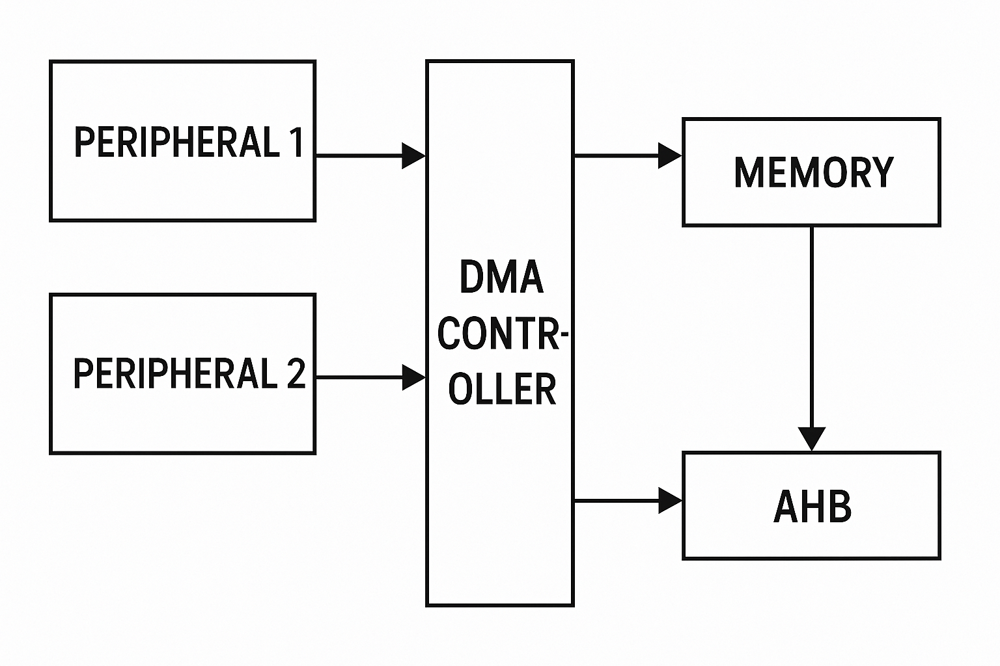

## 📘 TIMER 및 레지스터 설정 예제 (STM32)

⏱️ 일반 목적 Timer 설명 (TIM2~TIM5)

STM32F20x 시리즈에는 10개의 일반 목적 타이머가 포함되어 있으며, 이 중 TIM2, TIM3, TIM4, TIM5는 고기능 타이머로 다음과 같은 특징이 있습니다:

TIM2, TIM5: 32비트 업/다운 카운터 + 16비트 프리스케일러

TIM3, TIM4: 16비트 업/다운 카운터 + 16비트 프리스케일러

각 타이머는 4개의 독립 채널을 지원하여 입력 캡처, 출력 비교, PWM, One-Pulse 모드 등을 지원함 → 최대 16개의 채널 사용 가능

타이머 간 또는 고급 타이머(TIM1, TIM8)와의 동기화 지원 (Timer Link 기능)

디버그 모드에서도 타이머 정지 지원 가능 (freeze)

PWM 생성 및 엔코더 인터페이스(Quadrature Encoder Mode) 지원

각 타이머는 DMA 요청 생성 가능

📷 참고 이미지:

TIM2~5는 입력 캡처부터 모터 제어까지 다양한 목적에 사용되며, 특히 DMA와 연계하여 고속 신호 측정 및 PWM 제어에 적합합니다.